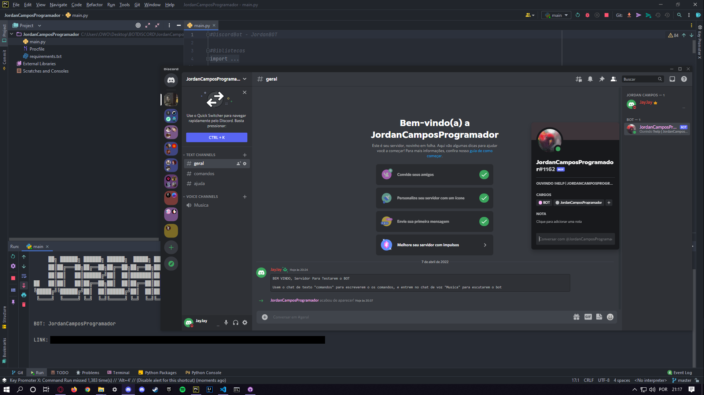

<h1 align="center">
  🤖️<br>DiscordMusic.py
</h1>

<h4 align="center">
  Um Discord Music Bot Feito com Python.
</h4>

<p align="center"></p>

<h4 align="center"><a href="https://discord.gg/f8bTfEbmER">Clique para ver o projeto</a></h4>
<h4 align="center"><a href="https://github.com/JordanCampos20/DiscordMusic.py/archive/refs/heads/main.zip">Clique para baixar o projeto</a></h4>

---

## Instalação
```
git clone https://github.com/JordanCampos20/DiscordMusic.py.git
```

```
pip install -r requirements.txt
```

```
Se você tiver python2 e python3, use pip3 ao fazer o download de requirements.txt 
```

```
Edite as var_{ALGO} do main.py Antes de Executar, Coloque as Informações do Seu BOT
```

## Executando

```
Execute o arquivo "main.py", ele vai iniciar o seu BOT
```

---

## 💼 Tecnologias utilizadas
Para o desenvolvimento deste aplicativo utilizei as seguintes tecnologias:

- Python 3.x;

---

## 📚 Bibliotecas Usadas
Para o desenvolvimento deste aplicativo utilizei as seguintes bibliotecas:

- discord.py==1.7.3, yt_dlp==2022.2.4, PyNaCl==1.5.0;

---

## 🦄 Autor<br>
<table>
  <tr>
    <td align="center">
      <a href="https://github.com/JordanCampos20">
        <br>
        <sub>
          <b>Jordan C.</b>
        </sub>
      </a>
    </td>
  </tr>
</table>

---